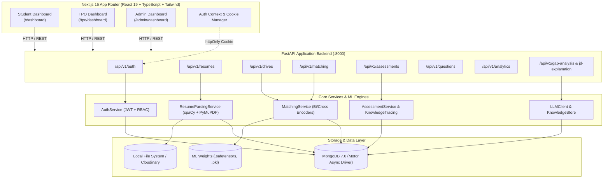

# 🎓 PLACER — AI-Powered Campus Recruitment & Placement Assistance System

> **Intelligent Student Evaluation, Resume Semantic Matching, Adaptive Skill Assessments & Placement Analytics Platform**

[](https://www.python.org/)
[](https://fastapi.tiangolo.com)
[](https://nextjs.org/)
[](https://react.dev/)
[](https://www.mongodb.com/)
[](https://tailwindcss.com/)
[](https://pytorch.org/)
[](LICENSE)

---

## 📌 Table of Contents

- [Overview](#-overview)
- [Key Features & Role Portals](#-key-features--role-portals)
  - [1. Student Portal](#1-student-portal)
  - [2. Training & Placement Officer (TPO) Portal](#2-training--placement-officer-tpo-portal)
  - [3. Administrator Portal](#3-administrator-portal)
- [Machine Learning & AI Architecture](#-machine-learning--ai-architecture)
  - [Resume Parsing & Skill Normalization](#resume-parsing--skill-normalization)
  - [Two-Stage Semantic Matching & Platt Calibration](#two-stage-semantic-matching--platt-calibration)
  - [Adaptive Assessment & Knowledge Tracing (EMA)](#adaptive-assessment--knowledge-tracing-ema)
  - [Anti-Cheat & Proctoring Engine](#anti-cheat--proctoring-engine)
  - [LLM & RAG Integration (Narrative Gap Analysis & JD Explanation)](#llm--rag-integration)
- [System Architecture](#-system-architecture)
- [Tech Stack](#-tech-stack)
- [Directory Structure](#-directory-structure)
- [Getting Started & Installation](#-getting-started--installation)
  - [Prerequisites](#prerequisites)
  - [1. Clone Repository & Setup Model Weights](#1-clone-repository--setup-model-weights)
  - [2. Backend Setup](#2-backend-setup)
  - [3. Frontend Setup](#3-frontend-setup)
  - [4. Environment Variables Configuration](#4-environment-variables-configuration)
  - [5. Database & Admin Bootstrapping](#5-database--admin-bootstrapping)
- [API Reference](#-api-reference)
- [Running Automated Tests](#-running-automated-tests)
- [Security & Authentication](#-security--authentication)
- [Troubleshooting & FAQs](#-troubleshooting--faqs)

---

## 🌟 Overview

**PLACER** (**P**lacement & **L**earning **A**ssistance with **C**andidate **E**valuation & **R**anking) is an enterprise-grade, full-stack campus recruitment and placement assistance ecosystem. It bridges the gap between students, Training & Placement Officers (TPOs), and institutional administrators by unifying:

1. **Automated Resume Parsing & Quality Scoring**
2. **AI-Powered Two-Stage Semantic Matching** (Bi-Encoder Retrieval + Cross-Encoder Reranking with Platt Calibration)
3. **Adaptive Skill Assessments & Knowledge Tracing** with anti-cheat protection
4. **LLM-Driven Diagnostic Gap Analysis & Explainable AI (XAI)**
5. **Real-time Placement Drive Management & Institutional Analytics**

Built to operate efficiently on modern developer infrastructure and free-tier production hosts (FastAPI, MongoDB Atlas, Next.js on Vercel), PLACER delivers high-accuracy candidate matching without requiring heavy external paid APIs.

---

## 🚀 Key Features & Role Portals

### 1. Student Portal
- **Smart Profile Management**: Real-time completeness calculation across academic, project, skill, and social profiles.
- **Resume Management & Multi-Version History**: PDF upload, automatic SHA-256 deduplication, versioning, asynchronous parsing, and structured preview.
- **Placement Drive Discovery**: Browse open placement drives with automated server-side eligibility checks (CGPA cutoff, department, batch year).
- **Match Score & Explainability**: Real-time compatibility rating against job descriptions showing matched skills, missing skills, and overall fit.
- **Adaptive Assessments**: Computerized adaptive test interface that adjusts difficulty in real time based on past responses.
- **Skill Mastery Insights**: Knowledge tracing visualizer displaying skill proficiencies and radar breakdowns.
- **LLM Gap Analysis**: AI-generated improvement roadmap detailing weak areas and recommended learning steps.

### 2. Training & Placement Officer (TPO) Portal
- **Drive Lifecycle Management**: Create, edit, open/close, and manage campus drives with granular eligibility rules.
- **AI-Ranked Applicant Dashboard**: Candidate sorting based on the multi-factor hybrid match score.
- **Deep-Dive Candidate Review**: 1-click access to candidate resumes, parsed profile summaries, and live skill mastery radar data.
- **Application Status Pipeline**: Dynamic candidate progression (`Applied` $\rightarrow$ `Shortlisted` $\rightarrow$ `Selected` $\rightarrow$ `Rejected`).
- **TPO Placement Funnel Analytics**: Visual representation of drive conversion rates, applicant counts, and hiring statistics.

### 3. Administrator Portal
- **Centralized Question Bank**: Comprehensive CRUD supporting Multiple Choice Questions (MCQs), Coding questions (exact output matching), and Descriptive questions.
- **Hierarchical Categories & Tags**: Tagging questions by difficulty (`Easy`, `Medium`, `Hard`) and domain topics.
- **Bulk Import / Export**: One-click bulk JSON question import and export utilities.
- **Assessment Builder**: Configure dynamic assessments with custom question pool limits, time limits, and anti-cheat policies.
- **Platform Analytics**: Institutional-level insights into placement percentage, overall attempt statistics, and weakest-first skill mastery trends.
- **Secure CLI Bootstrapping**: Zero-public-exposure administrative account provisioning script.

---

## 🧠 Machine Learning & AI Architecture

```
                                  ┌────────────────────────────────┐
                                  │       Student Resume (PDF)     │
                                  └───────────────┬────────────────┘
                                                  │
                                          PyMuPDF / spaCy
                                                  │
                                                  ▼
                                  ┌────────────────────────────────┐
                                  │   Parsed Skills & Experience   │
                                  └───────────────┬────────────────┘
                                                  │
 ┌───────────────────────────────┐                │
 │    Job Description (JD)       │                │
 └───────────────┬───────────────┘                │
                 │                                │
                 ▼                                ▼
┌──────────────────────────────────────────────────────────────────┐
│                   STAGE 1: BI-ENCODER RETRIEVAL                  │
│       all-MiniLM-L6-v2 Embeddings & Cosine Similarity Ranking    │
│              (Narrows Candidate Pool to Top Candidates)          │
└────────────────────────────────┬─────────────────────────────────┘
                                 │
                                 ▼
┌──────────────────────────────────────────────────────────────────┐
│                  STAGE 2: CROSS-ENCODER RERANKING                │
│             cross-encoder/stsb-roberta-base Joint Scoring        │
└────────────────────────────────┬─────────────────────────────────┘
                                 │
                                 ▼
┌──────────────────────────────────────────────────────────────────┐
│                     PLATT CALIBRATION LAYER                      │
│            Logistic Regression logit-to-probability map          │
└────────────────────────────────┬─────────────────────────────────┘
                                 │
                                 ▼
┌──────────────────────────────────────────────────────────────────┐
│                      HYBRID SCORING FORMULA                      │
│   Final = 0.50 * Calibrated_Semantic + 0.35 * Skill_Coverage     │
│                     + 0.15 * Experience_Fit                      │
└──────────────────────────────────────────────────────────────────┘
```

### Resume Parsing, Intelligent Fallback & PaddleOCR (PP-OCRv4)
- **Multi-Stage Text Extraction**:
  1. **PyMuPDF (`fitz`)**: Fast, native digital text extraction (<50ms).
  2. **`pdfplumber` Fallback**: Invoked when text encodings or PDF structures fail under PyMuPDF.
  3. **Intelligent Text Quality Evaluator**: Inspects character counts, alphanumeric density, and word distribution to detect image-only or scanned documents.
  4. **PaddleOCR (PP-OCRv4) Engine**: Automatically renders pages into high-resolution rasters and executes local OCR on scanned resumes, mixed image/text documents, or unparseable PDFs.
  5. **OCR Normalization Layer**: Cleans OCR line fragmentation and whitespace anomalies while preserving line boundaries for section parsing.
- **Named Entity Recognition (NER)**: spaCy `en_core_web_sm` model with heuristic line-validation fallbacks for candidate name identification.
- **Skill Normalizer**: Curated dictionary and alias-squashing system (e.g., `react.js` $\rightarrow$ `react`, `k8s` $\rightarrow$ `kubernetes`) to standardize skills across varying candidate terminology across both digital and OCR-derived text.
- **Lazy Singleton Architecture**: PaddleOCR engine loads on-demand on the first scanned document request, preventing slow startup times and conserving memory for normal digital text processing.


### Two-Stage Semantic Matching & Platt Calibration
1. **Bi-Encoder Retrieval**: Generates dense vector representations using a fine-tuned `all-MiniLM-L6-v2` bi-encoder. Computes cosine similarity to quickly rank and retrieve the top-N candidate matches.
2. **Cross-Encoder Pairwise Reranking**: Passes candidate-job text pairs through a fine-tuned `cross-encoder/stsb-roberta-base` model with joint attention across both documents.
3. **Platt Calibration**: Applies a fitted Logistic Regression model on cross-encoder logits to convert raw outputs into true probabilistic match scores.
4. **Hybrid Scoring Engine**:
   $$\text{Final Score} = 0.50 \times \text{Semantic Score} + 0.35 \times \text{Skill Coverage} + 0.15 \times \text{Experience Fit}$$
   Where:
   $$\text{Skill Coverage} = \frac{|\text{Resume Skills} \cap \text{JD Skills}|}{\max(1, |\text{JD Skills}|)}$$
   $$\text{Experience Fit} = \min\left(1.0, \frac{\text{Candidate Years}}{\max(1, \text{Required Years})}\right)$$

### Adaptive Assessment & Knowledge Tracing (EMA)
- **Dynamic Difficulty Adjustment**: Assessment begins at `Medium` tier. Correct answers increase difficulty (`Medium` $\rightarrow$ `Hard`), while incorrect answers step down (`Medium` $\rightarrow$ `Easy`), with automatic fallback when a difficulty pool is exhausted.
- **Knowledge Tracing Heuristic**: Tracks skill mastery using an Exponential Moving Average (EMA):
  $$\text{Mastery}_{t} = (1 - \alpha) \cdot \text{Mastery}_{t-1} + \alpha \cdot \text{Result}$$
  Maintains an uncalibrated, empirical mastery score per skill tag across all student attempts.

### Anti-Cheat & Proctoring Engine
- **Session Token Binding**: Unique secure test session token per browser attempt instance.
- **Server-Side Enforcement**: Strict server-side timer validation and auto-submission on expiry.
- **Option Randomization**: Dynamic per-delivery MCQ option shuffling (graded on option value, not index).
- **Violation Logging**: Real-time capture of client-side events:
  - Fullscreen exit / cancellation
  - Tab switching (`visibilitychange` API)
  - Clipboard copy/paste attempts
  - DevTools opening
- **Automatic Disqualification**: Configurable violation threshold triggering auto-submission.
- **Fast-Answer Auditing**: Flags answers submitted in $<3$ seconds to `activity_logs` for review.

### LLM & RAG Integration
- **Agnostic LLM Client**: Unified interface supporting **NVIDIA NIM** (`Nemotron-4-340B-Instruct`), **OpenRouter** (`Qwen-2.5`), or local **Ollama** (`qwen3:8b`).
- **Narrative Gap Analysis**: Ingests test attempt performance and generates human-readable diagnostics and action plans.
- **Explainable Match Narratives**: Translates hybrid match scores into structured, conversational feedback for candidates.
- **Vector Knowledge Store**: Lightweight cosine vector store over MongoDB embeddings using `nomic-embed-text`.

---

## 📐 System Architecture



---

## 💻 Tech Stack

| Layer | Technology | Description |
|---|---|---|
| **Frontend Framework** | Next.js 15.5 (App Router) | Server/Client rendering, Route Groups, React 19 |
| **Styling & UI** | Tailwind CSS 3.4 + Radix UI | Dark/Light theme, accessible Shadcn primitives |
| **State & Data Fetching** | TanStack React Query v5 | Auto-caching, mutations, optimistic refetches |
| **Form Management** | React Hook Form + Zod | Schema-based validation & error handling |
| **Data Visualization** | Recharts & Framer Motion | Analytics charts, funnel graphs, smooth transitions |
| **Backend API** | FastAPI (Python 3.11+) | Async ASGI framework, high-performance REST APIs |
| **Database Driver** | Motor + PyMongo | Asynchronous MongoDB connector |
| **Authentication** | PyJWT + Passlib + Google Auth | Dual-token rotation (in-memory access + httpOnly refresh) |
| **NLP & Resume Parsing** | PyMuPDF, pdfplumber, spaCy | Multi-engine text extraction & NER |
| **Machine Learning** | PyTorch, Transformers, Scikit-learn | RoBERTa bi/cross-encoders, Platt logistic calibration |
| **LLM & Generative AI** | OpenAI SDK, Ollama / NVIDIA NIM | RAG narrative synthesis, skill gap diagnosis |
| **Testing** | pytest, pytest-asyncio, mongomock-motor | 100+ automated unit and integration tests |
| **DevOps & Containers** | Docker & Docker Compose | Containerized backend & MongoDB services |

---

## 📁 Directory Structure

```text
Student-Evaluation-and-Improvement-System/
├── backend/
│   ├── app/
│   │   ├── core/                  # Configuration, database connection, security, deps
│   │   │   ├── config.py          # Pydantic BaseSettings (.env reader)
│   │   │   ├── database.py        # Motor async client & index definitions
│   │   │   ├── security.py        # Bcrypt hashing & JWT creation/verification
│   │   │   └── deps.py            # FastAPI dependency injections (RBAC)
│   │   ├── models/                # Pydantic Schemas & MongoDB Document models
│   │   │   ├── user.py            # User, Student, TPO, Admin models
│   │   │   ├── resume.py          # Resume document & parsed structures
│   │   │   ├── drive.py           # PlacementDrive, Company, Application models
│   │   │   ├── assessment.py      # Question, Assessment, Attempt models
│   │   │   └── analytics.py       # Analytics response structures
│   │   ├── repositories/          # Repository Pattern abstraction (Motor CRUD)
│   │   ├── services/              # Pure business logic layer
│   │   │   ├── auth_service.py
│   │   │   ├── resume_service.py
│   │   │   ├── resume_parsing_service.py
│   │   │   ├── matching_service.py
│   │   │   ├── assessment_service.py
│   │   │   ├── knowledge_tracing_service.py
│   │   │   └── analytics_service.py
│   │   ├── routers/               # FastAPI route definitions
│   │   │   ├── auth.py
│   │   │   ├── resumes.py
│   │   │   ├── drives.py
│   │   │   ├── matching.py
│   │   │   ├── assessments.py
│   │   │   ├── questions.py
│   │   │   ├── students.py
│   │   │   └── analytics.py
│   │   ├── ml/                    # Machine Learning sub-packages
│   │   │   ├── parsing/           # spaCy entity extractor, skill normalizer, text extractors
│   │   │   ├── matching/          # Inference wrapper, calibrator, skill ontology
│   │   │   │   └── artifacts/     # ML model weights (.safetensors, .pkl)
│   │   │   ├── llm/               # Model-agnostic LLM client & exception handlers
│   │   │   └── rag/               # Vector knowledge store & retrieval logic
│   │   └── main.py                # App factory, CORS, Rate limiting & lifespan
│   ├── scripts/
│   │   └── create_admin.py        # Interactive Admin Account creation CLI
│   ├── storage/                   # Local uploaded resume PDFs (git-ignored)
│   ├── tests/                     # 100+ pytest test suite
│   ├── Dockerfile
│   ├── requirements.txt
│   └── .env.example
├── frontend/
│   ├── app/
│   │   ├── (auth)/                # Auth route group (/login, /register)
│   │   ├── (student)/             # Student route group (/dashboard, /resume, /drives, /assessments)
│   │   ├── (tpo)/                 # TPO route group (/tpo/dashboard, /tpo/dashboard/drives)
│   │   ├── (admin)/               # Admin route group (/admin/dashboard, /questions, /assessments)
│   │   ├── layout.tsx             # Root layout with Query & Auth Providers
│   │   └── globals.css            # Tailwind design tokens & themes
│   ├── components/
│   │   ├── ui/                    # Reusable Radix/ShadCN UI components
│   │   └── shared/                # DashboardShell, MatchScoreCard, StatCard, Charts
│   ├── hooks/                     # Custom React Query hooks (useResumes, useDrives, etc.)
│   ├── lib/                       # Axios API client, token-store, client fingerprinting
│   ├── providers/                 # AuthProvider, QueryProvider
│   ├── types/                     # TypeScript type definitions
│   ├── package.json
│   └── tailwind.config.ts
├── docker-compose.yml             # Local multi-container Docker compose definition
├── PROJECT_PROGRESS.md            # Comprehensive phase-by-phase implementation log
└── README.md                      # Original quickstart guide
```

---

## 🛠️ Getting Started & Installation

### Prerequisites
- **Python 3.11+**
- **Node.js 20+** and **npm**
- **MongoDB 7.0+** (Local MongoDB service, Docker container, or MongoDB Atlas)
- **Git**

---

### 1. Clone Repository & Setup Model Weights

```bash
git clone https://github.com/anvitac7/Student-Evaluation-and-Improvement-System.git
cd Student-Evaluation-and-Improvement-System
```

#### ML Weights Setup (Optional for basic features, Required for Semantic Matching)
The pre-trained Transformer weights (~560 MB combined) should be placed in the artifacts folder:
```text
backend/app/ml/matching/artifacts/
├── bi_encoder/
│   ├── config.json
│   ├── tokenizer.json
│   └── model.safetensors
├── cross_encoder/
│   ├── config.json
│   ├── tokenizer.json
│   └── model.safetensors
└── calibrator.pkl
```
*(If model weights are not present, the system operates normally and semantic match endpoints return `503 Service Unavailable` without crashing the application).*

---

### 2. Backend Setup

1. **Navigate to the backend directory and create a virtual environment**:
   ```bash
   cd backend
   python -m venv .venv
   ```

2. **Activate the virtual environment**:
   - **Windows (PowerShell)**:
     ```powershell
     .venv\Scripts\Activate.ps1
     ```
   - **Linux / macOS**:
     ```bash
     source .venv/bin/activate
     ```

3. **Install dependencies**:
   ```bash
   pip install -r requirements.txt
   ```

4. **Download spaCy language model**:
   ```bash
   python -m spacy download en_core_web_sm
   ```

5. **Configure environment variables**:
   ```bash
   # Windows
   copy .env.example .env

   # Linux / macOS
   cp .env.example .env
   ```

6. **Generate a secure secret key**:
   ```bash
   python -c "import secrets; print(secrets.token_urlsafe(64))"
   ```
   Open `backend/.env` and assign the generated string to `JWT_SECRET_KEY`.

---

### 3. Frontend Setup

1. **Open a new terminal window, navigate to the frontend directory**:
   ```bash
   cd frontend
   ```

2. **Install Node dependencies**:
   ```bash
   npm install
   ```

3. **Configure environment variables**:
   ```bash
   # Windows
   copy .env.local.example .env.local

   # Linux / macOS
   cp .env.local.example .env.local
   ```

---

### 4. Environment Variables Configuration

#### Backend (`backend/.env`)
| Variable | Default Value | Description |
|---|---|---|
| `APP_NAME` | `PLACER API` | Application title |
| `APP_ENV` | `development` | Environment mode (`development`/`production`) |
| `MONGODB_URI` | `mongodb://localhost:27017` | MongoDB connection string |
| `MONGODB_DB_NAME` | `placer_db` | Target MongoDB database name |
| `JWT_SECRET_KEY` | *(Required)* | 64-character random secure key |
| `ACCESS_TOKEN_EXPIRE_MINUTES` | `15` | Access token lifespan |
| `REFRESH_TOKEN_EXPIRE_DAYS` | `7` | Refresh token lifespan |
| `STORAGE_BACKEND` | `local` | Resume storage mode (`local` / `cloudinary`) |
| `LOCAL_STORAGE_PATH` | `./storage` | Directory for uploaded resume PDFs |
| `OCR_ENABLED` | `true` | Enable/disable OCR fallback engine |
| `OCR_LANG` | `en` | OCR recognition language (`en`, `ch`, etc.) |
| `OCR_USE_GPU` | `false` | Enable GPU acceleration for PaddleOCR |
| `OCR_USE_ANGLE_CLS` | `true` | Angle classifier for rotated/skewed scans |
| `OCR_CONFIDENCE_THRESHOLD` | `0.5` | Minimum OCR line detection confidence |
| `OCR_TRIGGER_MIN_CHARS` | `50` | Char threshold below which OCR triggers |
| `OCR_MIN_ALPHANUMERIC_RATIO` | `0.5` | Min alnum ratio for valid digital text |
| `OCR_RENDER_DPI` | `150` | PDF page rendering raster DPI |
| `GOOGLE_CLIENT_ID` | `""` | Optional Google OAuth Client ID |
| `LLM_PRIMARY_PROVIDER` | `nvidia_nim` | Primary LLM Provider (`nvidia_nim` / `openrouter` / `ollama`) |
| `LLM_PRIMARY_MODEL` | `nvidia/nemotron-4-340b-instruct` | LLM model identifier |
| `LLM_PRIMARY_API_KEY` | `""` | API key for primary LLM |

#### Frontend (`frontend/.env.local`)
| Variable | Default Value | Description |
|---|---|---|
| `NEXT_PUBLIC_API_URL` | `http://localhost:8000` | Backend API base URL |
| `NEXT_PUBLIC_GOOGLE_CLIENT_ID` | `""` | Optional Google OAuth Web Client ID |

---

### 5. Database & Admin Bootstrapping

1. **Start MongoDB**:
   - **Option A — Docker Compose**:
     ```bash
     # From project root
     docker compose up -d mongodb
     ```
   - **Option B — Local MongoDB Service**: Ensure the MongoDB service is running on port `27017`.
   - **Option C — MongoDB Atlas**: Set your `MONGODB_URI` in `backend/.env`.

2. **Bootstrap the Administrator Account (One-Time CLI)**:
   ```bash
   cd backend
   python -m scripts.create_admin
   ```
   Follow the interactive prompt to set the administrator's Name, Email, and Password.

3. **Start the FastAPI Backend**:
   ```bash
   cd backend
   uvicorn app.main:app --reload --port 8000
   ```
   *Swagger API Documentation: [http://localhost:8000/api/docs](http://localhost:8000/api/docs)*

4. **Start the Next.js Frontend**:
   ```bash
   cd frontend
   npm run dev
   ```
   *Web Application: [http://localhost:3000](http://localhost:3000)*

---

## 📡 API Reference

### 🔐 Authentication (`/api/v1/auth`)
| Method | Endpoint | Access | Description |
|---|---|---|---|
| `POST` | `/auth/register/student` | Public | Register new Student account |
| `POST` | `/auth/register/tpo` | Public | Register new TPO account |
| `POST` | `/auth/login` | Public | Authenticate user, receive JWT & httpOnly refresh cookie |
| `POST` | `/auth/google` | Public | Google Identity OAuth token verification |
| `POST` | `/auth/refresh` | Public | Rotate refresh token & receive new access token |
| `POST` | `/auth/logout` | Authenticated | Revoke refresh token & clear cookies |
| `GET` | `/auth/me` | Authenticated | Retrieve current user profile & role |

### 📄 Resumes (`/api/v1/resumes`)
| Method | Endpoint | Access | Description |
|---|---|---|---|
| `POST` | `/resumes` | Student | Upload new PDF resume (deduplicates & parses) |
| `GET` | `/resumes/history` | Student | Get all uploaded resume versions |
| `GET` | `/resumes/{id}` | Student/TPO/Admin | Fetch parsed details for a specific resume |
| `GET` | `/resumes/{id}/download` | Student/TPO/Admin | Secure stream download of resume PDF |
| `POST` | `/resumes/{id}/reparse` | Student | Trigger synchronous re-parsing pipeline |

### 🏢 Placement Drives (`/api/v1/drives`)
| Method | Endpoint | Access | Description |
|---|---|---|---|
| `GET` | `/drives` | Authenticated | Browse available drives |
| `POST` | `/drives` | TPO | Create a new placement drive |
| `GET` | `/drives/mine` | TPO | List drives created by the authenticated TPO |
| `GET` | `/drives/{id}` | Authenticated | Get drive details & eligibility criteria |
| `PUT` | `/drives/{id}` | TPO (Owner) | Update drive details |
| `DELETE` | `/drives/{id}` | TPO (Owner) | Delete a placement drive |
| `POST` | `/drives/{id}/apply` | Student | Apply to drive (enforces eligibility) |
| `GET` | `/drives/{id}/applications`| TPO (Owner) | List applicants for a drive |
| `PATCH`| `/drives/{id}/applications/{app_id}`| TPO (Owner) | Update candidate status (`shortlisted`, `selected`, etc.) |

### 🎯 Semantic Matching (`/api/v1/matching`)
| Method | Endpoint | Access | Description |
|---|---|---|---|
| `GET` | `/matching/drives/{id}/score` | Student | Compute calibrated match score for active resume |
| `GET` | `/matching/recommended-drives` | Student | Get top recommended drives sorted by match score |
| `GET` | `/matching/drives/{id}/ranked-applicants` | TPO (Owner) | Get AI-ranked applicants for a drive |

### 📝 Assessments & Knowledge Tracing (`/api/v1/assessments`)
| Method | Endpoint | Access | Description |
|---|---|---|---|
| `GET` | `/assessments` | Authenticated | List all active assessments |
| `POST` | `/assessments` | Admin | Create new assessment & anti-cheat policy |
| `POST` | `/assessments/{id}/start` | Student | Start adaptive attempt, receive session token & 1st question |
| `POST` | `/assessments/attempts/{id}/answer` | Student | Submit answer, update mastery, fetch next question |
| `POST` | `/assessments/attempts/{id}/violation` | Student | Record client-side anti-cheat violation event |
| `GET` | `/assessments/attempts/{id}/results` | Student | Retrieve comprehensive score breakdown |
| `GET` | `/assessments/knowledge-states/me` | Student | Retrieve own skill mastery percentages |
| `GET` | `/assessments/knowledge-states/{student_id}` | TPO/Admin | Inspect specific student's mastery radar |

### 📊 Analytics (`/api/v1/analytics`)
| Method | Endpoint | Access | Description |
|---|---|---|---|
| `GET` | `/analytics/tpo` | TPO | Application status breakdown & drive funnels for owned drives |
| `GET` | `/analytics/admin` | Admin | Platform-wide placement rates, attempts, and weakest skills |

---

## 🧪 Running Automated Tests

The test suite includes over **100 automated unit and integration tests** built on `pytest` and `mongomock-motor` (requiring no live MongoDB instance to execute):

```bash
cd backend
.venv\Scripts\Activate.ps1   # or source .venv/bin/activate on Unix
python -m pytest -v
```

### Test Suite Highlights:
- `test_auth.py`: Registration, token rotation, RBAC, Google OAuth mocking.
- `test_resumes.py`: Versioning, magic-byte PDF validation, download security.
- `test_resume_parsing_units.py`: Contact extraction, section parsing, skill normalizer.
- `test_drives.py`: Drive CRUD, eligibility engine, duplicate prevention.
- `test_assessments.py`: Adaptive difficulty progression, anti-cheat violations, knowledge tracing.
- `test_matching.py`: Semantic inference, Platt calibration, hybrid ranking formulas.
- `test_analytics.py`: TPO/Admin aggregation and status calculation.

---

## 🔒 Security & Authentication

- **In-Memory JWT Access Tokens**: 15-minute access tokens stored exclusively in memory on the client to eliminate XSS token theft vectors.
- **Rotating httpOnly Refresh Cookies**: 7-day refresh tokens stored in secure, `httpOnly`, `SameSite=Lax` cookies. Each refresh request revokes the previous token and issues a new one (Replay-Resistant Rotation).
- **Role-Based Access Control (RBAC)**: Enforced strictly at the FastAPI dependency layer via `require_role("student" | "tpo" | "admin")`.
- **Content-Addressable Upload Validation**: PDF validation checks file magic bytes (`%PDF`), enforce strict size limits ($<5\text{MB}$), and deduplicate uploads via SHA-256 hashing.
- **Rate Limiting**: Integrated `slowapi` rate limiters on sensitive endpoints (`10/min` on auth routes, `100/min` global).

---

## ❓ Troubleshooting & FAQs

#### Q1: Why do matching endpoints return `503 Service Unavailable`?
> **Answer**: The ML weights (`bi_encoder/model.safetensors`, `cross_encoder/model.safetensors`, and `calibrator.pkl`) are missing from `backend/app/ml/matching/artifacts/`. All non-ML features will continue to work normally. Add the required model files to unblock AI matching.

#### Q2: How do I create an Administrator account?
> **Answer**: By design, there is no public `/register/admin` endpoint for security reasons. Run the interactive CLI script:
> ```bash
> cd backend
> python -m scripts.create_admin
> ```

#### Q3: Google Sign-In button doesn't show up on the frontend.
> **Answer**: Ensure `NEXT_PUBLIC_GOOGLE_CLIENT_ID` in `frontend/.env.local` and `GOOGLE_CLIENT_ID` in `backend/.env` are populated with a valid Google OAuth Web Client ID from Google Cloud Console.

#### Q4: Next.js build shows peer dependency warnings.
> **Answer**: The repository includes a `frontend/.npmrc` with `legacy-peer-deps=true` to ensure clean resolution with React 19. If installing packages manually, run `npm install --legacy-peer-deps`.

---

## 📄 License

This project is developed as an academic and engineering placement platform. Distributed under the MIT License. See `LICENSE` for details.
