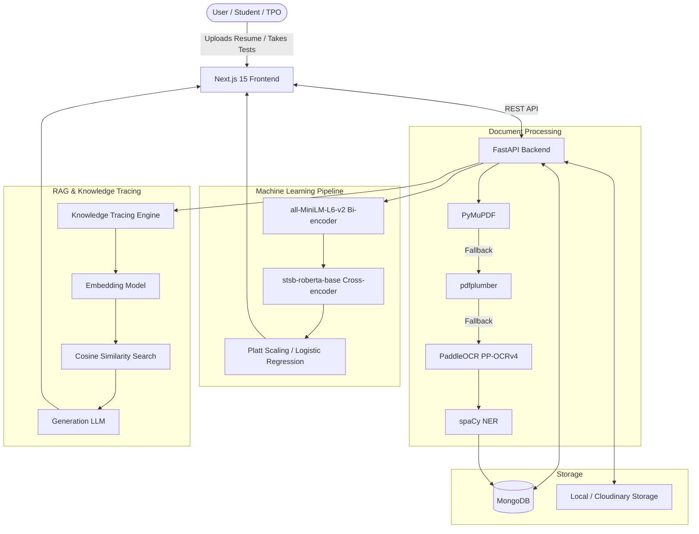
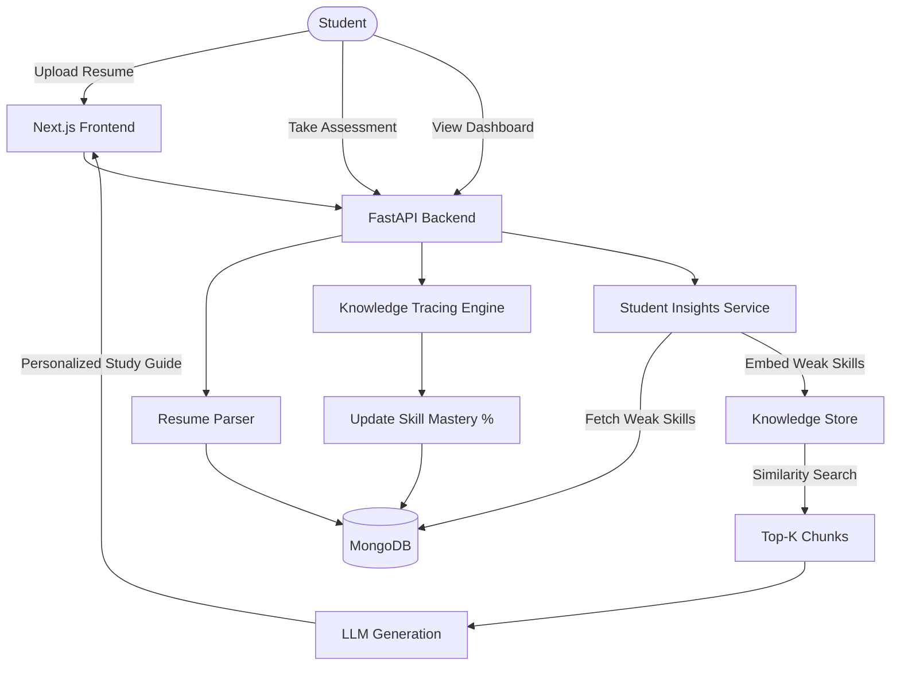

# Student Evaluation and Improvement System

## 1. Project Overview

The **Student Evaluation and Improvement System** (also known internally as **PLACER**) is a comprehensive AI-powered platform designed for students, Training & Placement Officers (TPOs), and administrators. It provides a full-stack environment for resume evaluation, semantic job matching, adaptive skill assessments (knowledge tracing), and personalized placement analytics.

The system is designed to provide actionable, data-driven insights into a student's academic standing and employability. By analyzing uploaded resumes, evaluating performance in adaptive coding/MCQ tests, and using Retrieval-Augmented Generation (RAG) to cross-reference weaknesses with syllabus or job requirements, the system produces concrete study plans and targeted focus areas.

### Major Capabilities
- **Resume Parsing & Quality Scoring**: Multi-stage document extraction utilizing PyMuPDF, pdfplumber, and PaddleOCR.
- **Semantic Job Matching**: A two-stage machine learning pipeline (Bi-encoder retrieval + Cross-encoder reranking) for highly accurate resume-to-job descriptions alignment.
- **Adaptive Knowledge Tracing**: Real-time assessment difficulty scaling based on student correctness.
- **RAG-Powered Student Insights**: Synthesizes deterministic assessment metrics with contextual knowledge to produce tailored, actionable study guides, reducing hallucination risk by grounding responses in retrieved knowledge.

### High-Level System Architecture Diagram


```mermaid
flowchart TD
    User([User / Student / TPO]) -->|Uploads Resume / Takes Tests| Frontend[Next.js 15 Frontend]
    Frontend <-->|REST API| Backend[FastAPI Backend]
    
    subgraph Document Processing
        Backend --> PyMuPDF[PyMuPDF]
        PyMuPDF -- Fallback --> PDFPlumber[pdfplumber]
        PDFPlumber -- Fallback --> PaddleOCR[PaddleOCR PP-OCRv4]
        PaddleOCR --> SpaCy[spaCy NER]
    end
    
    subgraph Machine Learning Pipeline
        Backend --> BiEncoder[all-MiniLM-L6-v2 Bi-encoder]
        BiEncoder --> CrossEncoder[stsb-roberta-base Cross-encoder]
        CrossEncoder --> Calibrator[Platt Scaling / Logistic Regression]
    end
    
    subgraph RAG & Knowledge Tracing
        Backend --> KT[Knowledge Tracing Engine]
        KT --> Embeddings[Embedding Model]
        Embeddings --> Similarity[Cosine Similarity Search]
        Similarity --> LLM[Generation LLM]
    end
    
    subgraph Storage
        Backend <--> MongoDB[(MongoDB)]
        Backend <--> LocalStorage[Local / Cloudinary Storage]
    end
    
    SpaCy --> MongoDB
    Calibrator --> Frontend
    LLM --> Frontend
```

---

## 2. Overall System Architecture

The architecture relies heavily on decoupling the deterministic CRUD/domain operations from the heavy-duty ML/AI operations.

1. **Frontend**: Next.js 15 App Router using React 19, TypeScript, and TailwindCSS + ShadCN UI. Handles client-side routing, JWT access tokens in memory (to mitigate XSS), and interactive visualizations.
2. **Backend**: FastAPI running on Python 3.11+. It uses the Repository Pattern (`BaseRepository`) to abstract database operations. Handles HTTP-only refresh tokens.
3. **Database**: MongoDB Atlas via the Motor async driver. Documents, resumes metadata, questions, placement drives, and vector embeddings are stored natively in MongoDB.
4. **Storage Pipeline**: Resumes are deduplicated via SHA-256 and stored locally in development or uploaded to Cloudinary in production.
5. **Document Pipeline**: An aggressive cascade strategy for PDFs (PyMuPDF → pdfplumber → PaddleOCR).
6. **ML Matching Pipeline**: Fine-tuned PyTorch models loaded via `transformers` (no external APIs required for the matching step).
7. **RAG Pipeline**: Fetches relevant syllabus/job description chunks from MongoDB using vector embeddings and passes them along with deterministic student metrics to an OpenAI-compatible LLM wrapper. The codebase is configured to support Nemotron, Qwen, Gemini, and local Ollama models (experimented with interchangeably based on environment).

---

## 3. Data and Document Extraction Pipeline

Accurate document extraction is critical, as a failed resume parse breaks the semantic matching pipeline. 

### Multi-Stage Extraction Flow

```mermaid
flowchart LR
    Doc[Upload PDF] --> PyMu[PyMuPDF (fitz)]
    PyMu --> Check1{Is Text Usable?}
    Check1 -- Yes --> Clean[Normalize Text]
    Check1 -- No --> Plumber[pdfplumber]
    
    Plumber --> Check2{Is Text Usable?}
    Check2 -- Yes --> Clean
    Check2 -- No --> OCR[PaddleOCR]
    
    OCR --> Clean
    Clean --> NER[spaCy NER / Regex]
    NER --> DB[(Database)]
```

### OCR Implementation

OCR is explicitly delayed until absolutely necessary (to maintain sub-100ms processing times for digital PDFs). When a PDF is scanned, image-only, or has a completely corrupted font encoding map, the backend falls back to **PaddleOCR (PP-OCRv4)**.

1. **Why OCR**: Without OCR, scanned resumes return empty strings or garbled characters, making downstream ML matching impossible.
2. **Library**: PaddleOCR (`paddleocr`) with the PP-OCRv4 models. Can run inside the primary environment or an external Python interpreter via subprocess to avoid dependency bloat.
3. **Preprocessing**: PyMuPDF (`fitz`) renders the specific PDF page to an in-memory image (PNG bytes) at a configurable DPI (e.g., 150-200 DPI). 
4. **Text Extraction**: The image bytes are fed into the PaddleOCR engine (`use_angle_cls=True`), running on either CPU or GPU.
5. **Output**: Detected bounding boxes are filtered using a configurable minimum confidence threshold.

---

## 4. PDF Processing

The system does not blindly rely on one PDF parser.

1. **PyMuPDF (`fitz`)**: The primary text extractor. Extremely fast and memory-efficient.
2. **pdfplumber**: The secondary extractor. Slower, but inherently handles complex visual layouts and unusual embedded fonts better than PyMuPDF.
3. **Usability Check**: Before accepting parsed text, the system checks:
   - **Minimum Character Count**: Scales proportionally with page count.
   - **Alphanumeric Ratio**: Prevents garbled encoding noise from passing as valid text.
   - **Word Density**: Ensures meaningful words are present.
4. **Cleaning/Normalization**: 
   - Collapses excessive newlines (3+ collapsed to 2).
   - Replaces tabs and carriage returns with spaces to maintain consistent chunking.

---

## 5. ML/AI Models Evaluated

The system relies on specific fine-tuned artifacts to ensure resume scoring and knowledge generation are accurate.

### 1. Bi-Encoder (`all-MiniLM-L6-v2`)
- **Type**: Sentence Transformer.
- **Input**: Resume text or Job Description text.
- **Output**: 384-dimensional dense vector embeddings.
- **Role**: Fast semantic retrieval. It embeds both the resume and the job description to compute a rapid cosine similarity. Fine-tuned with `MultipleNegativesRankingLoss`.

### 2. Cross-Encoder (`cross-encoder/stsb-roberta-base`)
- **Type**: RoBERTa-based pairwise sequence classifier.
- **Input**: Concatenated `[CLS] Resume [SEP] Job Description`.
- **Output**: Single raw logit representing alignment.
- **Role**: Precision reranking. Computes the deep cross-attention between the exact words in the resume and the job description. Far more computationally expensive than the bi-encoder, so it's only run on the top candidate pairs.

### 3. Platt Calibrator (`LogisticRegression`)
- **Type**: Classical ML (Scikit-Learn).
- **Input**: Sigmoid-transformed logit from the Cross-Encoder.
- **Output**: True probability match [0.0, 1.0].
- **Role**: Ensures the semantic scores scale uniformly, allowing the final hybrid formula to reliably mix semantic scores with hard skill-coverage percentages.

### 4. Named Entity Recognition (`en_core_web_sm`)
- **Type**: spaCy lightweight NER pipeline.
- **Role**: Extracts student names and explicit entities from resume text. Has a regex fallback in case the model is not downloaded.

---

## 6. Model Evaluation and Comparison

*(Note: The exact numeric validation metrics for the fine-tuned PLACER model are maintained within the offline Jupyter Training Notebooks `PLACER_RoBERTa_Training_NEW.ipynb` as the artifacts themselves are injected into the production environment post-training).*

During the training phase, the retrieve-and-rerank architecture was measured primarily on:
- **Recall@K (Bi-encoder)**: Ensuring the fast vector search didn't immediately drop the correct job descriptions.
- **Spearman Correlation (Cross-encoder)**: Ensuring the reranker correctly correlated with human-labeled resume-to-job match scores.
- **Calibration Error**: Measured via Brier score to validate the Logistic Regression Platt scaler.

---

## 7. Final Model Selection

The final architectural choice was a **Hybrid Retrieve-and-Rerank Pipeline**.

**Why not just use an LLM for scoring?**
Prompting an LLM to score a resume against a job description is incredibly slow, expensive, and subject to hallucinatory variability.

**Why not just use a Bi-encoder (Vector Search)?**
Bi-encoders are fast, but they compress an entire document into a single vector, losing the specific word-to-word relationships (e.g., matching "Python backend developer" vs "Developer who used Python once").

**The Selected Approach:**
By using a Bi-encoder to quickly filter down thousands of job descriptions (or resumes) via simple cosine similarity, and then applying the Cross-encoder to strictly evaluate the top-K candidates, the system achieves the precision of full-text cross-attention by using efficient candidate retrieval, followed by computationally expensive Cross-Encoder reranking on the top-K candidates.

---

## 8. RAG SYSTEM — MAIN SECTION

The Retrieval-Augmented Generation (RAG) system is the core intelligence behind the **Student Insights** module. 

### 8.1 Why RAG is Used
If an LLM is simply asked "How can the student improve?", it will output generic advice ("Study more Python"). By injecting RAG, the LLM is given the student's exact empirical weaknesses (e.g., "3 missed questions on Python generators") and the specific syllabus notes or job expectations related to that skill. RAG reduces hallucination risk by grounding responses in retrieved knowledge from the institution's actual curriculum.

### 8.2 Complete RAG Architecture


```mermaid
flowchart TD
    subgraph Data Ingestion
        Doc[Syllabus / JD] --> Chunking[Text Chunking]
        Chunking --> EmbedModel[Embedding Model]
        EmbedModel --> VectorStore[(MongoDB Vectors)]
    end

    subgraph Query Time
        StudentData[Student Attempt Data] --> Aggregator[Insight Aggregator]
        Aggregator --> WeakSkills[Identify Weak Skills]
        WeakSkills --> EmbedQuery[Embed Skill Query]
        EmbedQuery --> Search[MongoDB Search + Pre-filtering]
        Search --> Cosine[Python Dot Product]
        Cosine --> Context[Top-K Chunks]
        
        Context --> Prompt[Prompt Assembly]
        Aggregator --> Prompt
        Prompt --> LLM[Generation LLM]
        LLM --> UI[Personalized Study Plan]
    end
```

### 8.3 RAG Data Flow

**Indexing:**
1. Documents (Syllabus notes, Question explanations, Job descriptions) are passed to the `KnowledgeStore`.
2. Documents are chunked (detailed in Section 10).
3. The chunks are passed to the Embedding Model (via Ollama or OpenAI-compatible endpoint).
4. The vectors, along with explicit `tags` (skill names) and `chunk_type`, are stored natively in MongoDB. Python/NumPy performs the L2-normalized dot-product/cosine-similarity ranking (MongoDB Atlas Vector Search is not used).

**Retrieval:**
1. The student completes an assessment.
2. The `StudentInsightsService` aggregates their complete history and identifies focus areas (skills where mastery < 50%).
3. The names of the weak skills are embedded.
4. MongoDB filters documents by `tags` and `chunk_type` to drastically reduce the search space.
5. In Python, an L2-normalized dot product computes the semantic similarity of the candidates against the query vector.
6. The Top-K chunks are attached to the LLM generation prompt.

---

## 9. Embeddings and Semantic Search

- **Embedding Engine**: The system is abstracted to use any OpenAI-compatible `/embeddings` endpoint or a local Ollama instance (e.g., `nomic-embed-text`). 
- **Dimensionality**: Dynamic, determined by the underlying model and tracked in MongoDB via `embed_dim` and `embed_model`. The retrieval actively blocks comparisons between mismatched embedding models.
- **Search Metric**: Cosine Similarity. Because the vectors are L2-normalized immediately upon inference, the similarity reduces to a mathematically efficient dot product:

  `Cosine Similarity = Dot(Q_norm, V_norm)`

  *In simple terms: It measures the angle between the query vector and the document vector. If they point in the exact same direction (similarity ~1.0), their meanings are nearly identical, regardless of their text length.*

---

## 10. RAG Chunking Strategy

Implemented in `_chunk_text` within `knowledge_store.py`.

- **Chunk Size**: 1200 characters maximum.
- **Overlap**: 150 characters.
- **Strategy**: The chunker does not blindly cut words in half. It attempts to split at the paragraph boundary (`\n\n`). If a paragraph exceeds 1200 characters, it falls back to splitting at sentence boundaries (`[.!?]`). If a sentence is unusually long (like code or tables), it uses a hard character split with the 150-character overlap.
- **Why**: This semantic-aware chunking ensures that the context provided to the embedding model remains self-contained, greatly improving vector accuracy.

---

## 11. RAG Retrieval and Context Construction

The system avoids unnecessary computations:

1. **MongoDB Pre-filtering**: Instead of doing a brute-force vector search over all chunks, MongoDB instantly filters out irrelevant data by querying exact matches on `chunk_type` and `tags`.
2. **Scoring & Ranking**: The remaining small subset of documents has their vectors pulled into Python memory via NumPy. The dot product is calculated, and results are ranked in descending order.
3. **Context Construction**: The Top-K chunks (usually 5) are passed strictly as `reference_material` into the LLM payload.

```text
User Query (Implicit: "How do I improve my Python?")
    ↓
Query Embedding -> [0.12, -0.45, ...]
    ↓
Filter: tags contains "Python"
    ↓
Dot Product against Filtered Chunks
    ↓
Top 5 Relevant Syllabus Chunks
    ↓
Combine with Student's Specific Missed Questions
    ↓
LLM System Prompt
    ↓
Final Response
```

---

## 12. RAG + Structured Data / Student Information

The system uses **Hybrid RAG + Structured Data**.

The system relies on a firm separation between deterministic facts and LLM narrative:
- Student performance metrics (Overall Accuracy, Total Attempts) are calculated deterministically by the backend.
- Weak skills (Mastery < 50%) are identified by the Knowledge Tracing engine.
- Those specific weak skills are used to retrieve relevant syllabus or explanatory knowledge through the RAG pipeline.
- The retrieved knowledge + the deterministic student facts (including exact missed questions) are provided to the LLM.
- The LLM generates the personalized study plan based strictly on the provided context.
- The LLM does NOT calculate, infer, or invent the student's scores or mastery percentages.

---

## 13. Graph Component

**No dedicated graph database or explicit graph-based algorithmic reasoning is implemented in the current repository.** 

Instead, structured entity relationships are handled entirely via robust relational links within MongoDB:
- **Entities**: Students, Resumes, Applications, Placement Drives, Questions, and Knowledge States.
- **Relationships**: `Applications` explicitly map a `student_id` to a `drive_id`. `KnowledgeStates` track mastery tracking per `skill_tag` tied to a specific `student_id`.
- **Navigation**: The application traces these relationships via optimized, indexed queries rather than graph traversal algorithms. 

---

## 14. RAG + Graph Integration

Because there is no explicit graph component, **RAG and Graph reasoning do not directly interact**. 

Instead, RAG interacts strictly with the relational outputs of the Knowledge Tracing engine. The deterministic queries surface the weak tags (the "relational" step), and RAG provides the semantic lookup for those tags (the "semantic" step).

---

## 15. End-to-End System Flow


```mermaid
flowchart TD
    User([Student]) -->|Upload Resume| Web[Next.js Frontend]
    Web --> API[FastAPI Backend]
    
    API --> Parse[Resume Parser]
    Parse --> DB[(MongoDB)]
    
    User -->|Take Assessment| API
    API --> KTEngine[Knowledge Tracing Engine]
    KTEngine --> MasteryUpdate[Update Skill Mastery %]
    MasteryUpdate --> DB
    
    User -->|View Dashboard| API
    API --> Insights[Student Insights Service]
    Insights -->|Fetch Weak Skills| DB
    Insights -->|Embed Weak Skills| RAG[Knowledge Store]
    RAG -->|Similarity Search| Context[Top-K Chunks]
    Context --> LLM[LLM Generation]
    
    LLM -->|Personalized Study Guide| Web
```

---

## 16. API and Backend Implementation

The backend is built with **FastAPI**. It enforces authentication using JWT access tokens (short-lived) and rotating HTTP-only refresh tokens.

### Key Endpoints:
- `POST /api/v1/auth/login`: Authenticates users and sets HTTP-only refresh cookies.
- `POST /api/v1/resumes`: Uploads, validates, and triggers synchronous parsing (via PyMuPDF/OCR) of resumes.
- `POST /api/v1/drives/{id}/apply`: Applies to a placement drive, enforcing strict server-side eligibility checks (CGPA, department).
- `POST /api/v1/assessments/attempts/{id}/answer`: Submits an answer to the adaptive testing engine and receives the next question dynamically.
- `GET /api/v1/assessments/knowledge-states/me`: Retrieves deterministic mastery percentages per skill.

---

## 17. Frontend Implementation

The frontend utilizes the **Next.js 15 App Router** architecture.
- **Route Groups**: Folders like `(student)`, `(tpo)`, and `(admin)` logically separate distinct dashboards while maintaining clean URLs (e.g., `/dashboard`, `/tpo/dashboard`).
- **Security**: Access tokens are kept strictly in memory via `lib/token-store.ts`, drastically mitigating XSS attacks. Refresh tokens are handled transparently by an Axios interceptor.
- **Styling**: Tailwind CSS combined with ShadCN UI provides dark mode support and consistent design tokens.
- **Proxy**: `/api/backend/*` redirects to FastAPI, completely sidestepping CORS issues in production.

---

## 18. Technology Stack

| Layer | Technology | Purpose |
|---|---|---|
| **Frontend** | Next.js 15, React 19, Tailwind, ShadCN | Web interface, dashboard routing, interactive charts |
| **Backend** | FastAPI (Python 3.11+), Pydantic | Asynchronous API layer, business logic validation |
| **Database** | MongoDB Atlas, Motor | Native JSON document storage, vector embedding storage |
| **Document Processing** | PyMuPDF, pdfplumber | Fast digital text extraction |
| **OCR** | PaddleOCR (PP-OCRv4) | Fallback extraction for scanned/image PDFs |
| **ML Models** | Sentence-Transformers, spaCy | Semantic retrieval, cross-encoding, Named Entity Recognition |
| **RAG/LLM** | OpenAI API standard wrapper | LLM generations (configured to support Nemotron, Qwen, Gemini, and local Ollama) |

---

## 19. Project Structure

```text
placer/
├── frontend/
│   ├── app/                 # Next.js App Router pages
│   ├── components/          # ShadCN UI & custom components
│   └── lib/                 # API client, token store
├── backend/
│   ├── app/
│   │   ├── core/            # Config, DB, Security
│   │   ├── ml/              # LLM, Matching, OCR, Parsing, RAG logic
│   │   ├── models/          # MongoDB/Pydantic schemas
│   │   ├── repositories/    # Database Repository pattern
│   │   ├── routers/         # FastAPI endpoint controllers
│   │   └── services/        # Business logic (Insights, Knowledge Tracing)
│   ├── storage/             # Local file storage fallback
│   └── tests/               # Pytest suite
└── docker-compose.yml       # Local deployment composition
```

---

## 20. Installation and Setup

### Prerequisites
- Python 3.11+
- Node.js 18+
- MongoDB instance (local or Atlas)

### Backend Setup
```bash
cd backend
python -m venv .venv
source .venv/bin/activate  # Windows: .venv\Scripts\activate
pip install -r requirements.txt
python -m spacy download en_core_web_sm
cp .env.example .env
```
*(Populate `.env` with a `JWT_SECRET_KEY` and LLM variables)*

### Frontend Setup
```bash
cd frontend
npm install --legacy-peer-deps
cp .env.local.example .env.local
```

---

## 21. Running the System

**Option 1: Local Services (Development)**
```bash
# Terminal 1 (Backend)
cd backend
uvicorn app.main:app --reload --port 8000

# Terminal 2 (Frontend)
cd frontend
npm run dev
```

**Option 2: Docker**
```bash
docker compose up --build
```
Access the application at `http://localhost:3000`. The API Swagger docs are located at `http://localhost:8000/api/docs`.

---

## 22. Conclusion

The Student Evaluation and Improvement System proves the efficacy of unifying disparate data sources into a single pipeline. By seamlessly fusing multi-stage document OCR with high-precision machine learning models, the platform removes manual data entry while retaining high accuracy.

The implementation of the hybrid retrieve-and-rerank model ensures placement drives correctly align with student skills, while the Knowledge Tracing engine intelligently scales assessments based on real-time empirical performance. Finally, by treating RAG as an additive explanation layer rather than the core source of truth, the system successfully reduces hallucination risk by grounding responses in retrieved knowledge, providing students with deterministic, undeniable analytics combined with encouraging, context-rich study guides.
